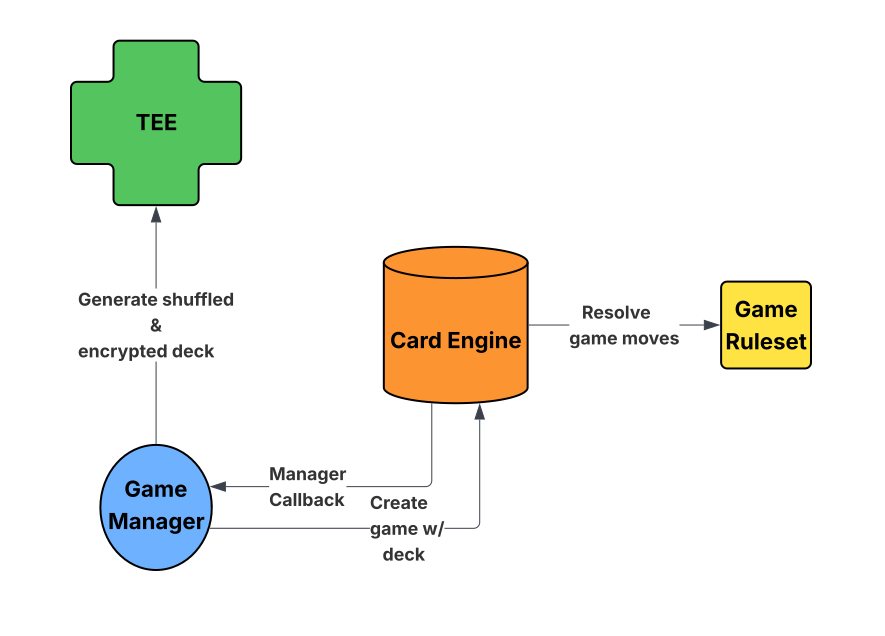

# card-game(wip)
A modular onchain crazy-eights-style card game engine with pluggable rulesets.



## Getting started

Prerequisites: [Bun](https://bun.sh/) installed.

```bash
# install repo toolchain (Biome, etc.)
bun install

# lint & type-style checks
bun lint
bun check

# format source
bun format
```

Project packages live in `contracts/` (Solidity + Foundry/Hardhat) and `tee/` (TEE shuffle service).
Refer to their READMEs for service-specific commands.
